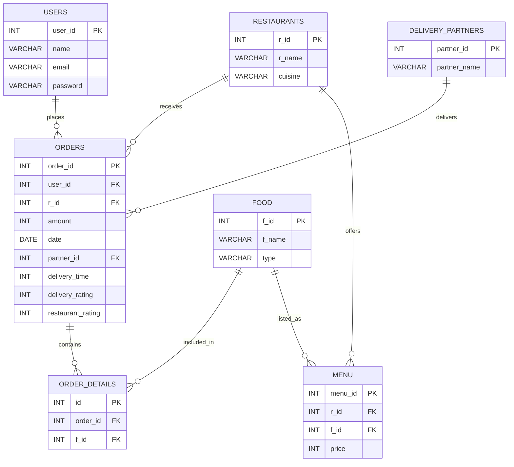

<div align="center">

# 🍔 Swiggy Database Management System

### A relational MySQL database design for a food-delivery platform

<p>
  
  
  
</p>

<p>
  <b>Users</b> · <b>Restaurants</b> · <b>Food & Menu</b> · <b>Orders</b> · <b>Delivery Partners</b>
</p>

</div>

---

## 📌 About the Project

This project models the core database structure of a **Swiggy-style food delivery application** using **MySQL**.

The database stores information about customers, restaurants, food items, menus, orders, delivery partners, and individual order details. Primary keys and foreign keys are used to maintain relationships and referential integrity between the tables.

> 🎯 **Goal:** Build a clean, normalized relational database that can support common food-delivery operations and SQL analysis.

---

## 🧩 Database at a Glance

```text
                         ┌─────────────────┐
                         │      USERS      │
                         │   customer info │
                         └────────┬────────┘
                                  │ 1 : N
                                  ▼
┌──────────────────┐       ┌─────────────────┐       ┌────────────────────┐
│ DELIVERY_PARTNERS│ 1 : N │     ORDERS      │ N : 1 │    RESTAURANTS     │
│ partner details  ├──────►│ order & ratings ├──────►│ restaurant details │
└──────────────────┘       └────────┬────────┘       └─────────┬──────────┘
                                   │ 1 : N                    │ 1 : N
                                   ▼                           ▼
                          ┌─────────────────┐          ┌─────────────────┐
                          │ ORDER_DETAILS   │          │      MENU       │
                          │ ordered food    │          │ restaurant menu │
                          └────────┬────────┘          └────────┬────────┘
                                   │ N : 1                      │ N : 1
                                   └──────────────┬──────────────┘
                                                  ▼
                                         ┌─────────────────┐
                                         │      FOOD       │
                                         │ food catalogue  │
                                         └─────────────────┘
```

---

## 🗺️ ER Diagram

### Visual ER Diagram


### MySQL Workbench Model


---

## 🔗 Entity Relationship Model



> 💡 **Tip:** GitHub renders Mermaid diagrams automatically in supported Markdown views. The PNG ER diagram is also included for environments where Mermaid is not rendered.

---

## 🗃️ Database Tables

| # | Table | Purpose | Primary Key |
|---|---|---|---|
| 1 | `users` | Stores customer account information | `user_id` |
| 2 | `restaurants` | Stores restaurant information | `r_id` |
| 3 | `delivery_partners` | Stores delivery partner information | `partner_id` |
| 4 | `food` | Stores food-item catalogue | `f_id` |
| 5 | `orders` | Stores customer orders and ratings | `order_id` |
| 6 | `menu` | Maps restaurants to food items and prices | `menu_id` |
| 7 | `order_details` | Maps orders to ordered food items | `id` |

---

## 📋 Table Structure

### 👤 `users`

| Column | Type | Key | Description |
|---|---|---|---|
| `user_id` | INT | PK | Unique customer ID |
| `name` | VARCHAR(255) | — | Customer name |
| `email` | VARCHAR(255) | UNIQUE | Customer email |
| `password` | VARCHAR(255) | — | Account password |

### 🏪 `restaurants`

| Column | Type | Key | Description |
|---|---|---|---|
| `r_id` | INT | PK | Unique restaurant ID |
| `r_name` | VARCHAR(255) | — | Restaurant name |
| `cuisine` | VARCHAR(255) | — | Cuisine category |

### 🛵 `delivery_partners`

| Column | Type | Key | Description |
|---|---|---|---|
| `partner_id` | INT | PK | Unique delivery partner ID |
| `partner_name` | VARCHAR(50) | — | Delivery partner name |

### 🍕 `food`

| Column | Type | Key | Description |
|---|---|---|---|
| `f_id` | INT | PK | Unique food ID |
| `f_name` | VARCHAR(255) | — | Food item name |
| `type` | VARCHAR(255) | — | Food type/category |

### 🧾 `orders`

| Column | Type | Key | Description |
|---|---|---|---|
| `order_id` | INT | PK | Unique order ID |
| `user_id` | INT | FK | Customer who placed the order |
| `r_id` | INT | FK | Restaurant receiving the order |
| `amount` | INT | — | Order amount |
| `date` | DATE | — | Order date |
| `partner_id` | INT | FK | Assigned delivery partner |
| `delivery_time` | INT | — | Delivery time value |
| `delivery_rating` | INT | — | Delivery rating |
| `restaurant_rating` | INT | — | Restaurant rating |

### 📖 `menu`

| Column | Type | Key | Description |
|---|---|---|---|
| `menu_id` | INT | PK | Unique menu record |
| `r_id` | INT | FK | Restaurant ID |
| `f_id` | INT | FK | Food item ID |
| `price` | INT | — | Food item price |

### 📦 `order_details`

| Column | Type | Key | Description |
|---|---|---|---|
| `id` | INT | PK | Unique order-detail record |
| `order_id` | INT | FK | Related order |
| `f_id` | INT | FK | Ordered food item |

---

## 🔄 Relationships

| Parent Table | Child Table | Relationship | Foreign Key |
|---|---|---|---|
| `users` | `orders` | 1 : Many | `orders.user_id` |
| `restaurants` | `orders` | 1 : Many | `orders.r_id` |
| `delivery_partners` | `orders` | 1 : Many | `orders.partner_id` |
| `orders` | `order_details` | 1 : Many | `order_details.order_id` |
| `food` | `order_details` | 1 : Many | `order_details.f_id` |
| `restaurants` | `menu` | 1 : Many | `menu.r_id` |
| `food` | `menu` | 1 : Many | `menu.f_id` |

---

## ⚙️ Technologies Used

| Technology | Usage |
|---|---|
| 🐬 **MySQL** | Relational database management |
| 🧮 **SQL** | Database creation and manipulation |
| 🗺️ **ER Modeling** | Entity and relationship design |
| 🛠️ **MySQL Workbench** | Database modeling and visualization |

---

## 🚀 Getting Started

### 1. Install MySQL

Install **MySQL Server** and optionally **MySQL Workbench** for database visualization.

### 2. Open the SQL Script

Open the included file:

```text
Swiggy_db.sql
```

### 3. Execute the Script

Run the SQL script in MySQL Workbench or a MySQL-compatible SQL client.

```sql
CREATE DATABASE swiggy_db;
USE swiggy_db;
```

The remaining commands create all seven tables and their relationships.

### 4. Verify the Database

```sql
USE swiggy_db;

SHOW TABLES;
```

Expected tables:

```text
+----------------------+
| Tables_in_swiggy_db  |
+----------------------+
| delivery_partners    |
| food                 |
| menu                 |
| order_details        |
| orders               |
| restaurants          |
| users                |
+----------------------+
```

---

## 🔎 Example SQL Queries

### View all restaurants

```sql
SELECT *
FROM restaurants;
```

### View orders with customer names

```sql
SELECT
    o.order_id,
    u.name AS customer_name,
    o.amount,
    o.date
FROM orders o
JOIN users u
    ON o.user_id = u.user_id;
```

### View orders with restaurant names

```sql
SELECT
    o.order_id,
    r.r_name AS restaurant,
    o.amount,
    o.date
FROM orders o
JOIN restaurants r
    ON o.r_id = r.r_id;
```

### View complete order information

```sql
SELECT
    o.order_id,
    u.name AS customer,
    r.r_name AS restaurant,
    f.f_name AS food_item,
    m.price,
    o.amount,
    o.date
FROM orders o
JOIN users u
    ON o.user_id = u.user_id
JOIN restaurants r
    ON o.r_id = r.r_id
JOIN order_details od
    ON o.order_id = od.order_id
JOIN food f
    ON od.f_id = f.f_id
LEFT JOIN menu m
    ON m.r_id = o.r_id
   AND m.f_id = od.f_id;
```

---

## 📊 Example Use Cases

```text
👤 Customer Management
        │
        ├── Register / identify users
        └── Store customer details

🏪 Restaurant Management
        │
        ├── Store restaurants
        ├── Maintain cuisine information
        └── Manage restaurant menus

🍔 Food Management
        │
        ├── Maintain food catalogue
        ├── Categorize food
        └── Store menu prices

🧾 Order Management
        │
        ├── Create orders
        ├── Track order items
        ├── Store order amount/date
        └── Record ratings

🛵 Delivery Management
        │
        ├── Assign delivery partners
        └── Store delivery ratings/time
```

---

## 🧠 Database Design Highlights

- 🔑 **Primary keys** uniquely identify records.
- 🔗 **Foreign keys** connect related entities.
- 🧩 `order_details` connects orders with food items.
- 🍽️ `menu` connects restaurants with available food items.
- 👤 `orders` connects customers, restaurants, and delivery partners.
- 🛡️ Foreign-key constraints help maintain **referential integrity**.
- 📈 The structure can be extended with payments, addresses, offers, order status, and delivery tracking.

---

## 📁 Project Structure

```text
Swiggy-Database/
│
├── README.md              📘 Project documentation
├── Swiggy_db.sql          🗄️ Database creation script
│
└── assests/
    ├── er-diagram.png     🗺️ ER diagram
    └── sql-model.png      🛠️ MySQL Workbench model
```

---

## 📜 License

This project is intended for **educational and database-practice purposes**.

<div align="center">

### 🍔 Swiggy Database Project
**Designed with MySQL • Modeled with MySQL Workbench • Documented with Markdown**

</div>
